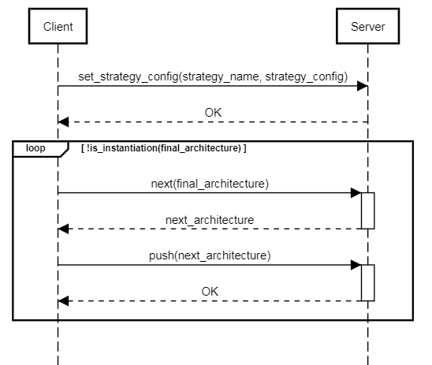

# prototype-template-engine
The project is the prototype of an Architecture-based Framework for automating the update of multiple microservices on multiple distributed PaaS platforms (ex. Cloud Foundry, Heroku). The framework supports various updating strategies (ex. BlueGreen, Canary, CleanRedeploy etc.), and greatly facilitates fixing failures during updating.

## Usage
### start server
```
git clone https://github.com/tao-xinxiu/prototype-template-engine.git
cd prototype-template-engine/
mvn install
java -jar target/prototype-template-engine-0.0.1-SNAPSHOT.jar
```

### setup client
The basic idea of perfoming an update process with the framework is demonstrated as following digram:   
The client could setup a pipeline (with tools as [Jenkins](https://jenkins.io/) or [Concourse](https://concourse.ci/)) as [example](https://gitlab.com/xxtao/microservices-demo-deployment), or write a simple script as [example](https://gitlab.com/xxtao/experiment/blob/master/scripts/update.sh) to send the update request to the server. Here is an example `update` script:
```
set_strategy_config(strategy_name, strategy_config)

while(!is_instantiation(final_architecture))
    next_architecture = next(final_architecture)
    push(next_architecture)
done
```
To perform a more prudent updating process, the user could invoke manually `next` and `push` command, so that it could always preview the next architecture before delivering it. This usage mode is often used during the implementation and testing of new custom strategy.

## Model
An [architecture](https://github.com/tao-xinxiu/prototype-template-engine/blob/master/src/main/java/com/orange/model/architecture/Architecture.java) is composed by the multiple PaaS sites, each site contains a set of [microservices architecture](https://github.com/tao-xinxiu/prototype-template-engine/blob/master/src/main/java/com/orange/model/architecture/Microservice.java).

## API
### pull current architecture
The endpoint get the current architecture of all managing PaaS sites.  
request: PUT /pull  
body: Collection<[PaaSSiteAccess](https://github.com/tao-xinxiu/prototype-template-engine/blob/master/src/main/java/com/orange/model/PaaSSiteAccess.java)> managingSites 

### push a desired architecture
The endpoint evolve the specified sites from their current architecture to the desired architecture.  
request: POST /push  
body: [Architecture](https://github.com/tao-xinxiu/prototype-template-engine/blob/master/src/main/java/com/orange/model/architecture/Architecture.java) desiredArchitecture

### calculate next desired architecture
The endpoint calculate the next desired architecture based on configured strategy.  
request: POST /next  
body: [Architecture](https://github.com/tao-xinxiu/prototype-template-engine/blob/master/src/main/java/com/orange/model/architecture/Architecture.java) finalArchitecture

### verify current architecture
The endpoint verify whether the current architecture is the instantiation of a desired architecture  
request: POST /is_instantiation  
body:  [Architecture](https://github.com/tao-xinxiu/prototype-template-engine/blob/master/src/main/java/com/orange/model/architecture/Architecture.java) desiredArchitecture 

### set strategy configuration
request: PUT /set_strategy_config  
parameter: strategy name  
body: [StrategyConfig](https://github.com/tao-xinxiu/prototype-template-engine/blob/master/src/main/java/com/orange/model/StrategyConfig.java)

### set operation configuration
request: PUT /set_operation_config  
body: [OperationConfig](https://github.com/tao-xinxiu/prototype-template-engine/blob/master/src/main/java/com/orange/model/OperationConfig.java)

## Robustness
This framework provides the kill-continue capability. That is, whenever the update process is stopped, either voluntarily by the user or involuntarily due to a failure, user could always re-start it by re-invoking the demonstrated  `update` [script](#client). In the practise, the user could easily configure `retry` in the pipeline setup or use loop in the script to avoid temporary failures (ex. network error). To correct the failure caused by microservice implementation or configuration, the user could change the desired microservice architecture `final_architecture`. In addition, the user could also change the chosen `strategy` to correct the erroneous strategy implementation.

## Updating Strategy
In the framework, user control the updating process by choosing a provided or custom strategy. The choice of strategy is depending on the microservice architecture constraints and non-functional requirement (availability, resource usage, or updating duration etc.)

### provided strategy
The following strategies is provided:
- [BlueGreen](https://github.com/tao-xinxiu/prototype-template-engine/blob/master/src/main/java/com/orange/strategy/impl/BlueGreenStrategy.java)
- [Canary](https://github.com/tao-xinxiu/prototype-template-engine/blob/master/src/main/java/com/orange/strategy/impl/CanaryStrategy.java)
- [BlueGreen Canary Mix](https://github.com/tao-xinxiu/prototype-template-engine/blob/master/src/main/java/com/orange/strategy/impl/BlueGreenCanaryMixStrategy.java)
- [BlueGreen by group](https://github.com/tao-xinxiu/prototype-template-engine/blob/master/src/main/java/com/orange/strategy/impl/BlueGreenGroupStrategy.java)
- [Straight](https://github.com/tao-xinxiu/prototype-template-engine/blob/master/src/main/java/com/orange/strategy/impl/StraightStrategy.java)
- [Inplace update with test](https://github.com/tao-xinxiu/prototype-template-engine/blob/master/src/main/java/com/orange/strategy/impl/InplaceTestStrategy.java)
- [Deploy](https://github.com/tao-xinxiu/prototype-template-engine/blob/master/src/main/java/com/orange/strategy/impl/DeployStrategy.java)
- [Clean up then redeploy](https://github.com/tao-xinxiu/prototype-template-engine/blob/master/src/main/java/com/orange/strategy/impl/CleanRedeployStrategy.java)
- [Add then Remove](https://github.com/tao-xinxiu/prototype-template-engine/blob/master/src/main/java/com/orange/strategy/impl/AddRemoveStrategy.java)
- [Remove then Add](https://github.com/tao-xinxiu/prototype-template-engine/blob/master/src/main/java/com/orange/strategy/impl/RemoveAddStrategy.java)

To perform the strategy sites by sites, you can simply specify `parallelAllSites` as `false` and set `sitesOrder` as the order of sites to update (e.x., `[["site1"], ["site2", "site3"], ["site4", "site5"]]`)

To choose the proper strategy, you could check their comparison in the following table. It shows the influence of applying different strategies for updating the code of a microservice.

| strategy | multi-version coexisted | duration | resource consumption | performance degradation | available instances |
|-----------|-----|-----|---------|-----|---------|
| BlueGreen | Yes | ++  | N ~ 2N  | 0   | N ~ 2N  |
| Canary    | Yes | +++ | N-1 ~ N | +   | N-1 ~ N |
| Mix       | Yes | ++  | N ~ N+1 | 0   | N ~ N+1 |
| Inplace   | No  | +   | N       | +++ | 0 ~ N   |
| CleanRedeploy | No | ++ | 0 ~ N | ++++ | 0 ~ N  |

In the table, the property `resource consumption` is shown by the number of instances. `N` means desired number of instances of the microservice. The property `available instances` means the number of instances in running. It is used to demonstrate more clearly `performance degradation`, as more instances available mean less performance degradation.

### custom strategy
The user could implement its proper strategy by implement [Strategy interface](https://github.com/tao-xinxiu/prototype-template-engine/blob/master/src/main/java/com/orange/strategy/Strategy.java). The key of the implementation of a strategy is to specify a sequence of [transitions](https://github.com/tao-xinxiu/prototype-template-engine/blob/master/src/main/java/com/orange/strategy/Transition.java). The `transitions` defined in [strategy library](https://github.com/tao-xinxiu/prototype-template-engine/blob/master/src/main/java/com/orange/strategy/StrategyLibrary.java) could be used to compose a new strategy.

## Evaluation
An evaluation of this prototype is available in [another repo](https://gitlab.com/xxtao/experiment).
